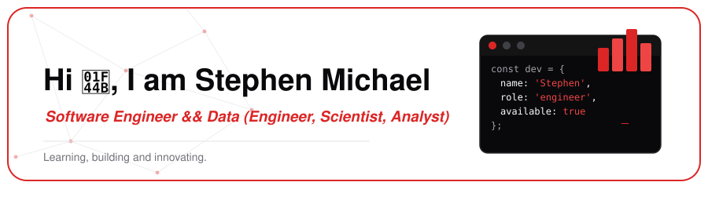

 

## About me

I'm a software engineer currently learning and building things as a **full stack software engineer**, while also growing my skills in **data science and data engineering**. I enjoy turning ideas into working products end to end  from the UI down to the database and I'm equally excited about the world of data: cleaning it, modeling it, and pulling insight out of it.

- 🔭 Currently building full stack projects with **React**, **Node.js**, and **Spring Boot**
- 📊 Currently learning data engineering, data analysis, and data science
- 🌱 Sharpening my SQL, Java, and system design skills
- 💬 **Get in Touch at:** `stepehenmichaelswe@gmail.com`
- ⚡ Fun fact: I like exploring both sides of the stack  building the product **and** understanding the data behind it

 

## Tech stack & tools

<table>
<tr>
<th colspan="5"></th>
</tr>
<tr>
<td align="center" width="90"> <b>HTML</b></td>
<td align="center" width="90"> <b>CSS</b></td>
<td align="center" width="90"> <b>Tailwind</b></td>
<td align="center" width="90"> <b>JavaScript</b></td>
<td align="center" width="90"> <b>React</b></td>
</tr>
<tr>
<th colspan="5"></th>
</tr>
<tr>
<td align="center" width="90"> <b>Node.js</b></td>
<td align="center" width="90"> <b>Java</b></td>
<td align="center" width="90"> <b>Spring Boot</b></td>
<td width="90"></td>
<td width="90"></td>
</tr>
<tr>
<th colspan="5"></th>
</tr>
<tr>
<td align="center" width="90"> <b>SQL</b></td>
<td width="90"></td>
<td width="90"></td>
<td width="90"></td>
<td width="90"></td>
</tr>
<tr>
<th colspan="5"></th>
</tr>
<tr>
<td align="center" width="90"> <b>VS Code</b></td>
<td align="center" width="90"> <b>Linux</b></td>
<td align="center" width="90"> <b>Git</b></td>
<td align="center" width="90"> <b>GitHub</b></td>
<td width="90"></td>
</tr>
</table>

 

## GitHub stats

 

Thanks for stopping by feel free to connect on any of the platforms above 👋

